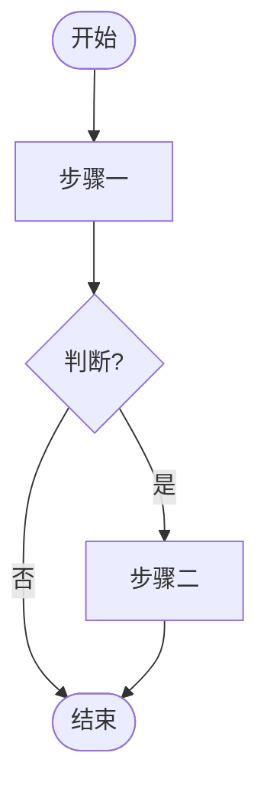
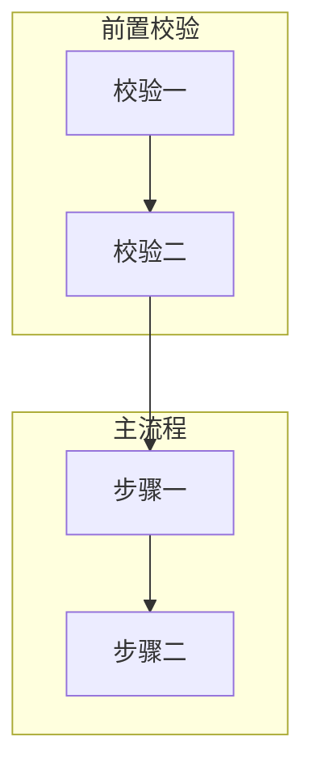
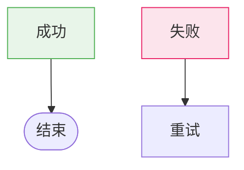
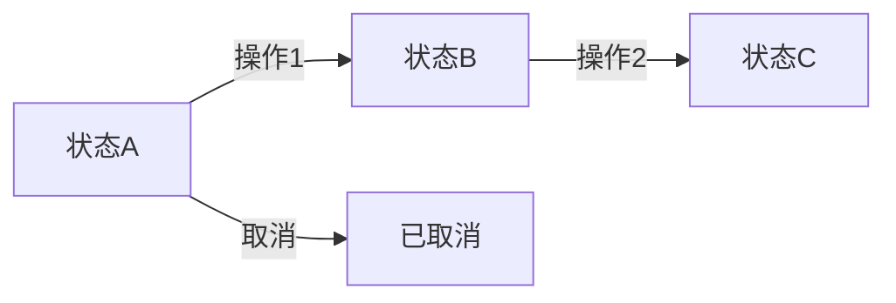
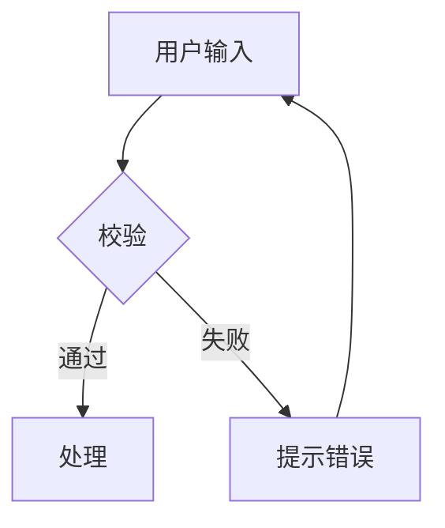
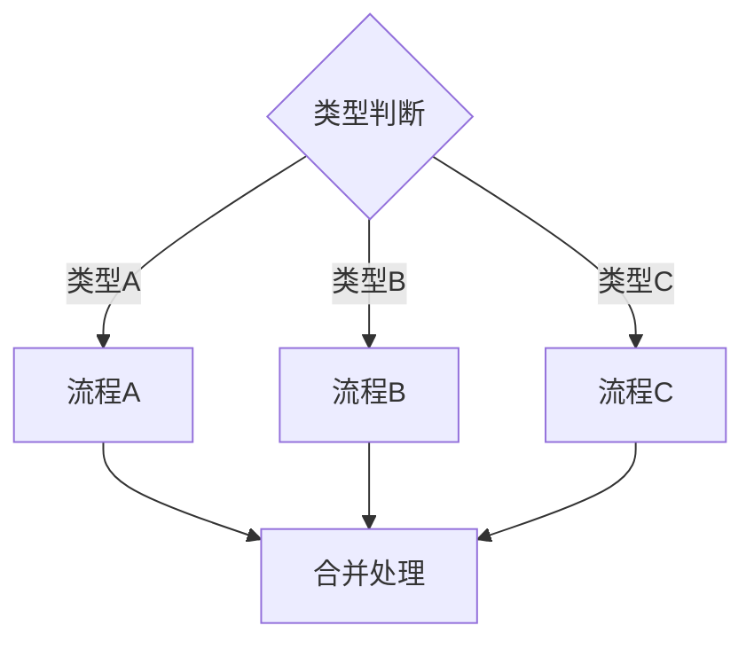

# 流程图生成规则 V1.0

定义如何使用 mermaid flowchart 生成业务流程图，适用于各类业务场景。

---

## 适用场景

当版本涉及以下内容时，应生成流程图：

| 场景 | 流程图类型 |
|------|-----------|
| 完整业务流程（下单、审批、任务流转） | 全流程图，作为首章概述 |
| 状态机（订单状态、审批状态） | 状态流转图 |
| 复杂页面交互（多步骤表单、弹窗链） | 页面内交互流程图 |
| 跨页面校验逻辑（配送校验、支付校验） | 校验流程子图 |

---

## 流程图结构规范

### 基本语法

使用 `flowchart TB`（从上到下）或 `flowchart LR`（从左到右）：



### 节点类型

| 语法 | 形状 | 适用场景 |
|------|------|----------|
| `([文本])` | 圆角矩形 | 开始/结束节点 |
| `[文本]` | 矩形 | 普通步骤 |
| `{文本}` | 菱形 | 判断/分支 |
| `[[文本]]` | 子程序 | 调用外部流程 |
| `>文本]` | 不对称 | 输入/输出 |

### 连接线类型

| 语法 | 样式 | 适用场景 |
|------|------|----------|
| `-->` | 实线箭头 | 主流程 |
| `--` | 实线无箭头 | 并行关系 |
| `-.->` | 虚线箭头 | 可选流程、异常流程 |
| `==>` | 加粗箭头 | 关键路径 |

---

## 子图组织

使用 `subgraph` 组织流程模块：



### 子图命名规范

- 使用中文命名，描述流程阶段
- 常见阶段名称：
  - 前置校验、输入处理、主流程、结果处理、异常处理
  - 用户操作、系统校验、数据流转、状态更新

---

## 样式标注

使用 `style` 为关键节点添加颜色：



### 颜色约定

| 状态 | 颜色 | 说明 |
|------|------|------|
| 成功/完成 | `#e8f5e9` / `#4caf50` | 绿色系 |
| 失败/错误 | `#fce4ec` / `#e91e63` | 红色系 |
| 警告/阻断 | `#fff3e0` / `#ff9800` | 橙色系 |
| 中间态/可选 | `#f5f5f5` / `#999` | 灰色系 |

---

## 文案规范

### 节点文案

- 简短明确，2-8字
- 使用动宾结构（校验库存、锁定库存）
- 判断节点使用问句结尾（支付成功?）

### 连线标签

- 简短条件（是/否、成功/失败）
- 使用 `-->|标签|` 格式
- 同一判断节点的分支标签应对应

---

## 常见流程模板

### 状态流转图



### 校验流程图



### 多分支流程图



---

## 生成原则

1. **流程图必须在源码中有对应实现** — 不臆测未实现的流程
2. **分支完整** — 每个判断节点必须覆盖所有分支
3. **命名统一** — 节点命名与源码中的变量/函数命名尽量一致
4. **层次清晰** — 使用子图分隔不同阶段
5. **样式标注** — 成功/失败/警告节点使用约定颜色

---

## Mermaid → SVG 渲染方案

业务逻辑清单中的 mermaid 流程图需渲染为 SVG 图片以支持文档预览，同时保留 mermaid 源码为 `<details>` 折叠备份。

### 渲染优先级

按以下顺序尝试渲染，任一成功即停止：

| 优先级 | 方案 | 命令 | 适用条件 |
|--------|------|------|----------|
| 1 | **mermaid-cli (mmdc)** 本地渲染 | `mmdc -i input.mmd -o output.svg --theme default --backgroundColor white` | 本机已安装 mmdc |
| 2 | **kroki.io** POST API | `curl -X POST -H "Content-Type: application/json" -d '{"diagram_source":"...","diagram_type":"flowchart","output_format":"svg"}' https://kroki.io/flowchart/svg` | 有网络，流程图 ≤ 100行 |
| 3 | **mermaid.ink** GET API | `https://mermaid.ink/svg/base64_encoded_content` | 有网络，流程图 ≤ 80行且无中文 |
| 4 | **留待后续生成** | 保存 `.mmd` 源文件，文档中引用空占位 | 所有方案失败 |

### 方案详解

#### 方案1：mmdc 本地渲染（推荐）

```bash
# 安装
npm install -g @mermaid-js/mermaid-cli

# 生成
mmdc -i flowchart.mmd -o flowchart.svg --theme default --backgroundColor white
```

**优点**：无网络依赖、无行数限制、支持中文、渲染准确
**缺点**：首次安装需下载 Chromium（~150MB）

#### 方案2：kroki.io POST API

```bash
curl -X POST \
  -H "Content-Type: application/json" \
  -d "{\"diagram_source\": \"$(cat flowchart.mmd | python3 -c 'import json,sys; print(json.dumps(sys.stdin.read()))')\", \"diagram_type\": \"flowchart\", \"output_format\": \"svg\"}" \
  "https://kroki.io/flowchart/svg" \
  -o flowchart.svg
```

**优点**：无需安装、支持中文
**缺点**：依赖网络、复杂流程图（>100行）容易504超时

#### 方案3：mermaid.ink GET API

```bash
# zlib压缩 + base64编码
CONTENT=$(cat flowchart.mmd | python3 -c "
import sys, zlib, base64
data = sys.stdin.read().encode('utf-8')
compressed = zlib.compress(data, 9)
encoded = base64.urlsafe_b64encode(compressed).decode('ascii')
print(encoded)
")

curl "https://mermaid.ink/svg/$CONTENT" -o flowchart.svg
```

**优点**：无需安装、GET请求简单
**缺点**：中文内容容易导致500错误、URL长度限制约8000字符

### 文档引用格式

```markdown


<details>
<summary>Mermaid 源码</summary>

\```mermaid
flowchart TB
    ...
\```

</details>
```

### 源文件管理

- 保存独立 `.mmd` 文件（如 `flowchart_order_payment.mmd`），与 SVG 同目录
- 更新流程图内容后，重新执行渲染命令生成新 SVG
- `.mmd` 文件纳入版本控制，便于后续重新渲染

### 常见失败场景

| 失败现象 | 原因 | 解决方案 |
|----------|------|----------|
| kroki.io 返回 504 | 流程图过大（>100行），服务端超时 | 改用 mmdc 本地渲染 |
| mermaid.ink 返回 500 | URL中的中文字符编码问题 | 改用 kroki.io 或 mmdc |
| mmdc 报 MODULE_NOT_FOUND | Node版本升级后全局包路径变化 | 重新 `npm install -g @mermaid-js/mermaid-cli` |
| mmdc 报 puppeteer 错误 | Chromium 下载失败（ECONNRESET） | 重试安装或检查网络代理 |

---

## 常见错误

| 错误 | 正确做法 |
|------|----------|
| 节点文案过长 | 2-8字，动宾结构 |
| 判断节点无问号 | 使用问句结尾（校验通过?） |
| 所有节点同色 | 成功/失败使用约定颜色 |
| 分支不完整 | 覆盖所有判断分支 |
| 虚线表示主流程 | 虚线仅用于可选/异常流程 |
| 仅用在线服务渲染 | 优先使用 mmdc 本地渲染，在线服务作为备选 |